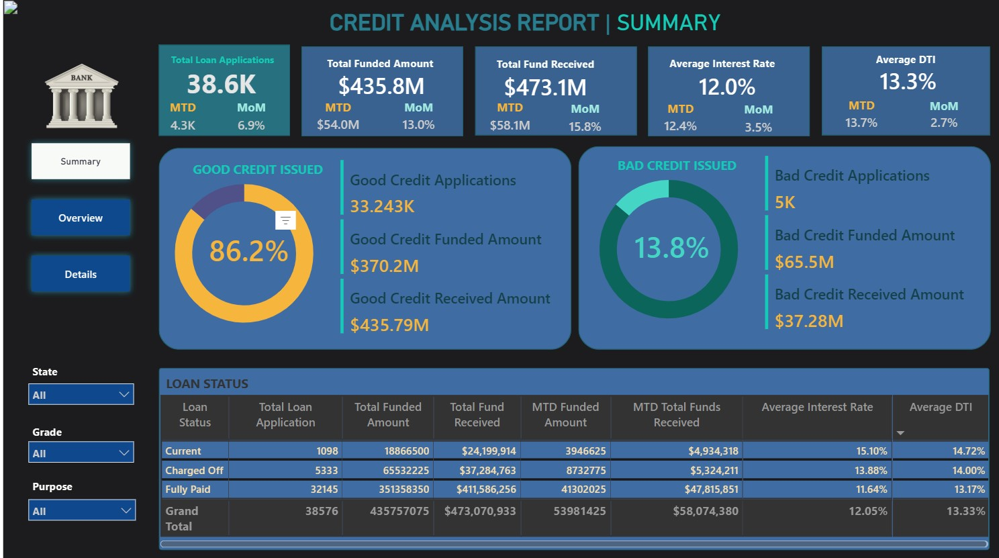

# Credit Analysis Dashboard

## Project Overview
This dashboard provides a comprehensive Credit Analysis Report aimed at monitoring and assessing a bank's lending activities and loan portfolio health. It visualizes key credit metrics and trends to empower data-driven lending decisions.
)

## Features
- Total loan applications tracking with Month-to-Date (MTD) and Month-over-Month (MoM) changes
- Analysis of total funded amounts and total amounts received
- Average interest rates and borrower debt-to-income ratio visualization
- Breakdown of good credit vs bad credit with corresponding KPIs
- Interactive charts: line charts, bar charts, donut charts, tree maps, and filled maps by region
- Detailed loan status grid for granular portfolio insights

## Technologies Used
- Power BI for dashboard creation and visualization
- SQL for querying loan data
- HTML embedding for dashboard sharing

## Files Included
- `Dashboard.html` - Embedded Power BI dashboard code
- `Credit-Analysis-Report.docx` - Detailed analysis and explanation of dashboard KPIs
- `CREDIT-ANALYSIS-REPORT-SQL-QUERY.docx` - SQL queries used to extract key metrics from loan data
- `financial_loan_data.csv` - Source dataset file used for the analysis and dashboard

## Usage
1. Open `Dashboard.html` in a modern web browser to view the embedded Power BI report.
2. Refer to the report document for understanding the KPIs and methodology.
3. Use the provided SQL queries as a reference or for replicating data extraction.

## Author
Sumit Mandloi
[Specify license, e.g., MIT License]

